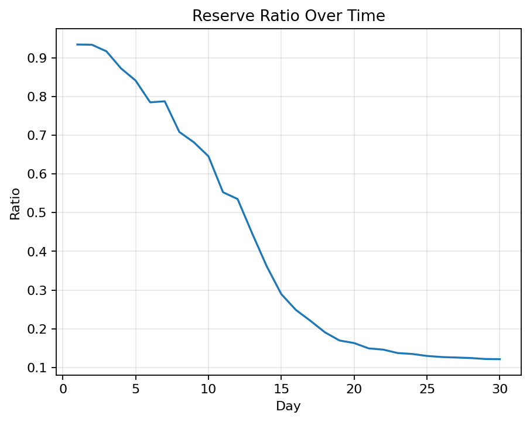
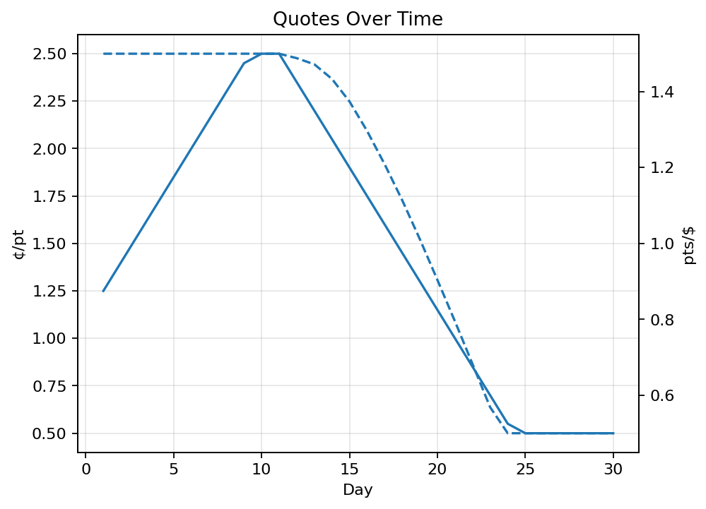
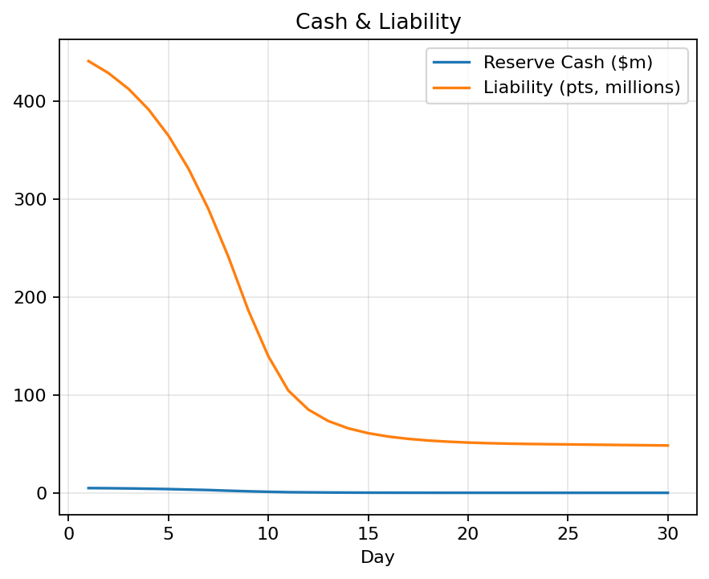

# Credit Card Points Market Maker (MVP)

Simulation-driven controller that adjusts **issuance** (points per $) and **redemption price** ($/pt) to keep reserves within a target band while managing points liability.

## Quickstart
```bash
pip install -r requirements.txt
python -m src.market_maker --config config.json --env-prefix APP_
python scripts/plots.py
# Optional
streamlit run streamlit_app.py
```
Artifacts: `data/sim_output.json`, `data/sim_history.csv`, logs in `logs/app.log`

## Demo Images
<p align="center">
  
  
  
</p>

## Config & Overrides
Env prefix (default `APP_`), nested via `__`:
```bash
APP_CONTROLLER__TARGET_RESERVE_RATIO=0.65 APP_SIMULATION__DAYS=180 python -m src.market_maker --config config.json
```
